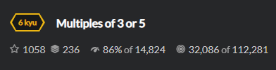
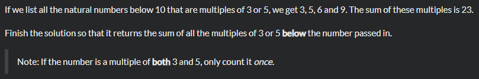

# Task 


Нам нужно, чтобы программа возвращала сумму всех кратных 3 или 5 переданного числа функции

#  Solution

```python
def solution(number):
	sum = 0
	for x in range(number):
		if x%3==0 or x%5==0:        
			sum = sum+x	
	return sum
```
Если остаток от числа равен 0, то оно кратно ему. Далее считаем сумму таких чисел. Можно использовать `sum+=x`.


## Sample Tests
```python
test.describe("Multiples of 3 and 5")

test.it("should handle basic cases")
test.assert_equals(solution(10), 23)
```