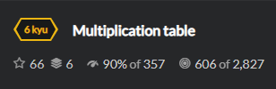
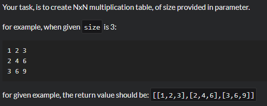

# Task 


Необходимо создать матрицу NxN. Данная матрица должна быть такой же как и в задании.

# Solutions
```python
import numpy as np
def multiplication_table(size):
	scope = []
	for i in range(size):
		scope.append(i+1)
	array = np.array([scope])
	array = np.outer(array, array)
	s = array.tolist()
	print(s)
	return s 
multiplication_table(2)
multiplication_table(3)    
```
Была использована библиотека `numpy` для решения данной задачи. Единственная ошибка, заключалась в том, что она выдает матрицу не совсем нужного нам вида и поэтому был использован метод `.tolist()`
## Sample Tests
```python
test.describe("Basic Tests")
test.it("Should pass basic tests")
test.assert_equals(multiplication_table(3), [[1,2,3],[2,4,6],[3,6,9]])
```