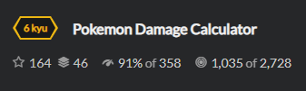

# Task

Нужно посчитать урон Покемона в драке. Формула расчета:


Также Покемоны обладают разными типами атак. Это учитывается в эффективности.


И коэффициенты:


# Solution

```python
def calculate_damage(your_type, opponent_type, attack, defense):
    
    effectiveness = 0.5 
    # If us pockemon fire 
    if your_type == 'fire':
    	if opponent_type == 'grass':
    		effectiveness = 2
    	if opponent_type == 'water':
    		effectiveness = 0.5
    	if opponent_type == 'electric':
    		effectiveness = 1
    	if opponent_type == 'fire':
    		effectiveness = 1
    # If us pockemon water
    if your_type == 'water':
    	if opponent_type == 'grass':
    		effectiveness = 0.5
    	if opponent_type == 'electric':
    		effectiveness = 0.5
    	if opponent_type == 'fire':
    		effectiveness = 2
    # If us pockemon grass
    if your_type == 'grass':
    	if opponent_type == 'electric':
    		effectiveness = 1
    	if opponent_type == 'water':
    		effectiveness = 2
    	if opponent_type == 'fire':
    		effectiveness = 0.5
    # If us pockemon electric
    if your_type == 'electric':
    	if opponent_type == 'fire':
    		effectiveness = 1
    	if opponent_type == 'water':
    		effectiveness = 2
    	if opponent_type == 'grass':
    		effectiveness = 1


    damage = 50*(attack/defense) * effectiveness
    pass
    return damage

```

# Validate

```python
calculate_damage('fire', 'water', 100, 100)
calculate_damage('grass', 'water', 100, 100)
calculate_damage('electric', 'fire', 100, 100)
calculate_damage('grass', 'electric', 57, 19)
calculate_damage('grass', 'water', 40, 40)
calculate_damage('grass', 'fire', 35, 5)
calculate_damage('fire', 'electric', 10, 2)

```
