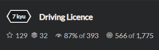
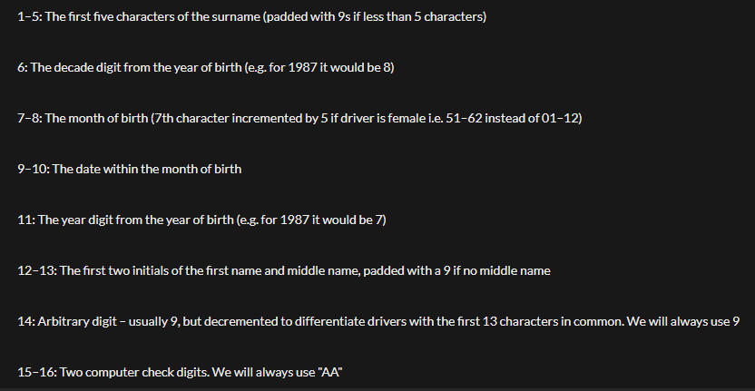
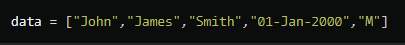
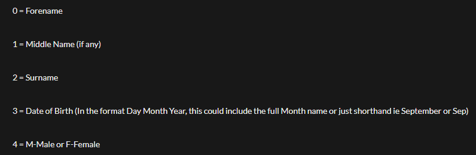

# Task


В конечном итоге необходимо передать строку с нужными параметрами. Вид массива и правила можно посмотреть ниже.
## Rules

## Data 

## Array elements 

# Solution
```python
from datetime import datetime
def driver(data):
    print(data)
    first = data[2].upper() #  The first five characters of the surname (padded with 9s if less than 5 characters)
    while len(first)<5:
        first = first + '9'
    if len(first) > 5:
        first = first[0:5]
    print(first)
    formatData = data[3]
    if len(formatData) <= 11:
        formatData = str(datetime.strptime(formatData, "%d-%b-%Y"))
    else:
        formatData = str(datetime.strptime(formatData, "%d-%B-%Y"))
    two = formatData[2] # The decade digit from the year of birth (e.g. for 1987 it would be 8)
    three = formatData[5:7]
    if data[4] == 'F':
        three = str(int(three) + 50) # The month of birth (7th character incremented by 5 if driver is female i.e. 51–62 instead of 01–12)
    four = formatData[3] # 11: The year digit from the year of birth (e.g. for 1987 it would be 7)
    lost = str(formatData[8:10]) # 9–10: The date within the month of birth
    name = data[0]
    middle_name = data[1]
    if middle_name > '':   # 12–13: The first two initials of the first name and middle name, padded with a 9 if no middle name
        five = name[0] + middle_name[0]
    else: 
        five = name[0] + '9'
    six = '9' + 'AA' # 14 and 15 
    finaly = first + two + three + lost + four  + five + six  # result
    print(finaly) 
    return finaly

   
data = ["John", "James", "Smiths", "01-Jan-2000", "M"]
driver(data)
data = ["Johanna", "", "Gibbs", "13-Dec-1989", "F"]
driver(data)
data = ["Andrew", "Robert", "Lee", "02-September-1989", "M"]
driver(data)
```