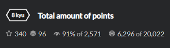
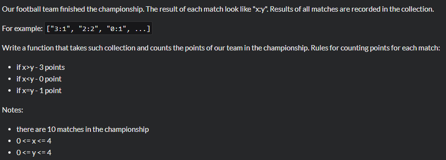

# Task 


Необходимо посчитать сколько очков наберет команда за 10 матчей при определенных результатах.
# Solution

```python
def points(games):
    our_points = 0
    for game in games:
        if game[0] > game[2]:
            our_points = our_points + 3
        elif game[0] == game[2]:
            our_points = our_points + 1
        else: 
            pass
    return our_points
points(['1:1','2:2','6:3','4:4','2:2','3:3','4:4','3:3','4:4','4:4'])
```
Из-за того, что результаты переданны в массиве, очень просто использовать с помощью индексов. С помощью `for` мы разбиваем один большой массив всех игр на массив с результатом одной игры.

## Sample Tests
```python
Test.describe("Basic Tests")
Test.assert_equals(points(['1:0','2:0','3:0','4:0','2:1','3:1','4:1','3:2','4:2','4:3']), 30)
Test.assert_equals(points(['1:1','2:2','3:3','4:4','2:2','3:3','4:4','3:3','4:4','4:4']), 10)
Test.assert_equals(points(['0:1','0:2','0:3','0:4','1:2','1:3','1:4','2:3','2:4','3:4']), 0)
Test.assert_equals(points(['1:0','2:0','3:0','4:0','2:1','1:3','1:4','2:3','2:4','3:4']), 15)
Test.assert_equals(points(['1:0','2:0','3:0','4:4','2:2','3:3','1:4','2:3','2:4','3:4']), 12)
```